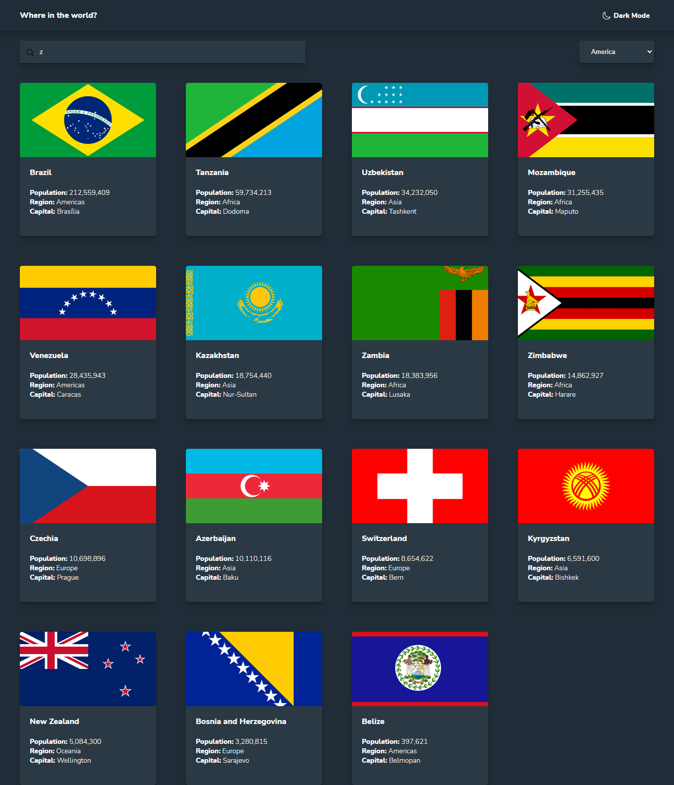

# Frontend Mentor - REST COUNTRIES APP

This is a solution to the [REST Countries API with color theme switcher](https://www.frontendmentor.io/challenges/rest-countries-api-with-color-theme-switcher-5cacc469fec04111f7b848ca). Frontend Mentor challenges help you improve your coding skills by building realistic projects.

## Table of contents

- [Frontend Mentor - REST COUNTRIES APP](#frontend-mentor---rest-countries-app)
  - [Table of contents](#table-of-contents)
    - [Screenshot](#screenshot)
    - [Links](#links)
    - [Built with](#built-with)
  - [Author](#author)

### Screenshot

### Links

- Solution URL: [Solution](https://www.frontendmentor.io/solutions/rest-countries-app-with-theme-switcher-Drd8ji46I))
- Live Site URL: [Live Preview](https://rest-countries-app-ar.netlify.app/#/)

### Built with

- [React](https://reactjs.org/) - JS library
- Sass
- CSS custom properties
- Flexbox
- CSS Grid
- Desktop-first workflow

## Author

- Frontend Mentor - [@D3press3dd](https://www.frontendmentor.io/profile/D3press3dd)
